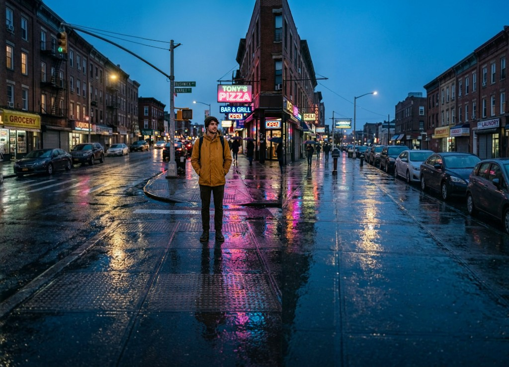

# Image Extender

> Seamlessly extend any image in any direction with AI — and pick the variant
> you like best before committing.

A small open-source web app for AI outpainting. Powered by Google's Gemini
image models via [OpenRouter](https://openrouter.ai), with a Poisson-blending
pipeline that hides the seam between original and AI-generated pixels.

Bring your own OpenRouter API key — it stays in your browser, never on the
server.



## Before / After

A single 1024 × 1024 phone-style portrait → a wide 16:9 cinematic frame, in
a few clicks. Same colors, same lighting, same wet-pavement reflections —
just much, much more of them.

| Before · 1024 × 1024 | After · extended L+R into a cinematic wide |
| --- | --- |
|  |  |

## Features

- **Click an edge → extend in that direction.** Spatial controls on the image,
  no dialog-tree UX.
- **Best-of-3 variant picker.** Every extension generates 3 candidates,
  sorted by seam quality. Cycle through them with `← →` and pick the one
  you like before accepting.
- **Poisson-blended seams.** Uses gradient-domain image editing (Pérez et al.
  2003) with mask-grow + replicate-padded Gauss-Seidel iterations to make the
  AI-original boundary mathematically invisible.
- **Pre-correction for low-frequency color drift.** Bulk-shifts the AI output
  toward the original's color at the seam before blending, which fixes the
  "the sky got slightly bluer" failure mode common to outpainting.
- **Optional prompt + art style.** Leave the prompt blank for pure scene
  continuation, or add specific instructions like *"add an alien moon
  rising on the horizon"*.
- **Custom art styles.** 40+ styles from cinematic and oil painting to
  Studio Ghibli, cyberpunk, vaporwave, etc.
- **BYOK (Bring Your Own Key).** Your OpenRouter key is stored only in your
  browser's `localStorage`. The server proxies your requests to OpenRouter
  but never logs or persists the key.
- **Model picker.** Switch between Gemini 3 Flash Image (Nano Banana 2) and
  Gemini 2.5 Flash Image (Nano Banana) from Settings.
- **Keyboard-first.** Arrow keys to extend, `←`/`→` to cycle variants,
  `Enter` to accept, `R` to regenerate, `Esc` to discard.
- **Generate from scratch.** Don't have a base image? Generate one with a
  text prompt first, then extend.

## How it works

```
┌─────────────┐   1. expand canvas with        ┌───────────────────┐
│  original   │ ──  light-gray blank area ──▶  │  expanded canvas  │
└─────────────┘     in chosen direction        └─────────┬─────────┘
                                                         │
                                                         ▼
                                              ┌─────────────────────┐
                                              │  Gemini outpaints   │
                                              │  the blank region   │
                                              └─────────┬───────────┘
                                                        │
                                                        ▼
                                              ┌─────────────────────┐
                                              │  pre-correct color  │
                                              │  drift at seam      │
                                              └─────────┬───────────┘
                                                        │
                                                        ▼
                                              ┌─────────────────────┐
                                              │  Poisson blend with │
                                              │  grown mask         │
                                              └─────────┬───────────┘
                                                        │
                                                        ▼
                                              ┌─────────────────────┐
                                              │  measure seam       │
                                              │  residual, repeat   │
                                              │  ×3, sort, present  │
                                              └─────────────────────┘
```

For horizontal extensions we run the pipeline up to 3 times in parallel
attempts (each at a different temperature), measure the seam residual of
each blended result, and present the candidates sorted best-blend first.
You're free to cycle and pick a different one if you prefer the AI's
content choices over the cleanest seam.

Vertical extensions use a different chunked path that's deterministic
enough that 1 attempt usually suffices.

## Quick start

```bash
git clone https://github.com/boona13/image-extender.git
cd image-extender
npm install
npm run dev
```

Open [http://localhost:3000](http://localhost:3000). On first load the app
will prompt for your OpenRouter API key — paste it once, it's stored locally,
you'll never see the prompt again unless you clear it from Settings.

Get a key at [openrouter.ai/keys](https://openrouter.ai/keys). It costs
about **$0.03 per Gemini extension** (Nano Banana 2 / 3 Flash Image).

### Optional: server-side env fallback

If you'd rather not enter the key in the browser (or you're hosting a demo
where you want to provide the key for visitors), copy `.env.example` to
`.env.local` and fill in your key:

```bash
cp .env.example .env.local
# edit .env.local and add your OPENROUTER_API_KEY
```

When set, the server will use this key for any request that doesn't
include a client-provided one.

## Usage

| Action | How |
| --- | --- |
| **Upload image** | Drag & drop, click the dropzone, or generate one from text |
| **Extend** | Click one of the four edge handles, or press `↑` `↓` `←` `→` |
| **Cycle variants** | `←` `→` arrow keys (or chevrons in the pill below the image) |
| **Accept variant** | Click `Accept` or press `Enter` |
| **Regenerate** | Click `Regenerate` or press `R` (gets 3 new variants) |
| **Discard** | Click `Discard` or press `Esc` |
| **Download** | Click `Download` (variant index is included in the filename) |

Optional custom prompt and art style live in the bottom command bar.
Leave the prompt blank for natural scene continuation, or describe what
you want added — e.g. *"a futuristic terraforming colony in the distance
with glass biodomes glowing softly"*.

## Tech stack

- **[Next.js 14](https://nextjs.org/)** (App Router) + React 18 + TypeScript
- **[Tailwind CSS](https://tailwindcss.com/)** for the dark studio theme
- **HTML Canvas** for all client-side image manipulation
  ([app/utils/imageProcessor.ts](app/utils/imageProcessor.ts))
- **[OpenRouter](https://openrouter.ai)** for model access
  - Default: `google/gemini-3.1-flash-image-preview` (Nano Banana 2)
  - Alternative: `google/gemini-2.5-flash-image` (Nano Banana)

## Project structure

```
app/
├── api/
│   ├── extend/route.ts       Outpainting endpoint (proxies OpenRouter)
│   └── generate/route.ts     Text-to-image endpoint
├── utils/
│   └── imageProcessor.ts     Canvas: chunking, Poisson blending, seam scoring
├── globals.css               Dark "studio" design system
├── layout.tsx                Root layout, Inter font
└── page.tsx                  All UI: workspace, edge handles, variant picker, settings
```

## Configuration knobs

A few small values you might want to tune:

| Constant | Where | Default | Meaning |
| --- | --- | --- | --- |
| `EXTENSION_PERCENT` | `app/page.tsx` | `38` | How much of the current dimension each extension adds |
| `maxAttempts` | per model in `app/page.tsx` | `3` | Number of best-of-N candidates per horizontal extension |
| `GROW_PX` | `app/utils/imageProcessor.ts` | `8` | Pixels to grow the Poisson mask into the original |
| `iterations` | `app/utils/imageProcessor.ts` | `250` | Max Gauss-Seidel iterations |

## Privacy & security

- The OpenRouter API key entered in the UI is stored **only** in your
  browser's `localStorage`. It is never written to the server's disk and
  never logged. The server uses it once per request to proxy the call to
  OpenRouter, then discards it.
- The server-side `OPENROUTER_API_KEY` env var is **optional** and acts only
  as a fallback for requests that don't include a client-provided key.
- No analytics, no telemetry, no tracking.

## Acknowledgments

- Poisson image editing technique: **Pérez, Gangnet, and Blake (2003) —
  "Poisson Image Editing"**, SIGGRAPH.
- Google for the Gemini image models, OpenRouter for the unified API.

## License

[MIT](LICENSE)
